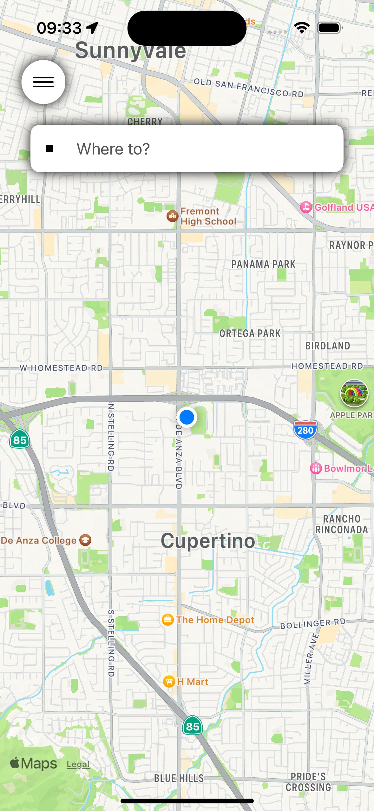
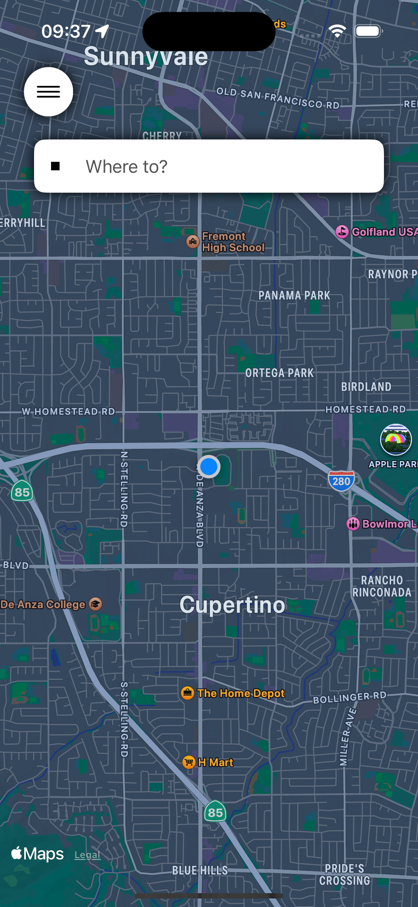
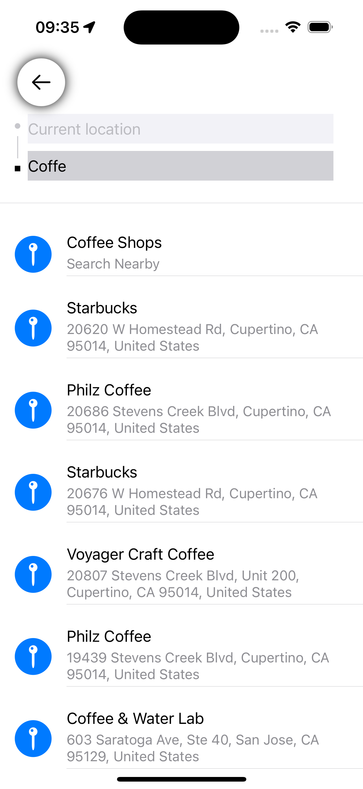
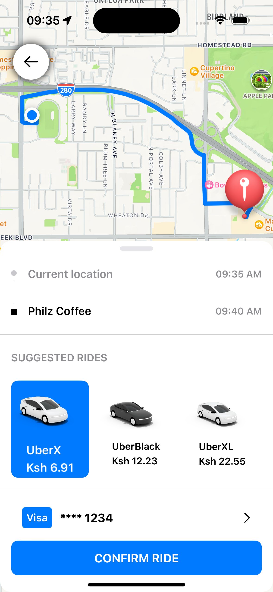
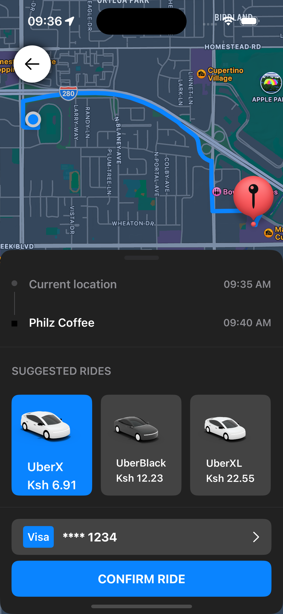

Youtube Link: https://www.youtube.com/watch?v=Z6-KVWXbw-w&t=356s

- To change Location on simulation. Click anywhere on simulator, Then on top menus, click Features > Location > Custom Location
- To change Themes i.e. Light and Dark Theme on Simulator, Click anywhere on simulator, Then Click Command+Shif+A

# ScreenShots

